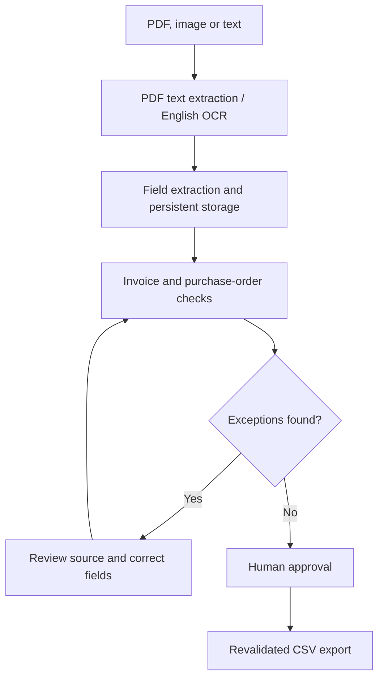

<div align="center">

# DocOps AI

### Document intelligence with a reviewable decision trail.

Extract invoice data. Match purchase orders. Resolve exceptions. Export approved records.


[Features](#features) · [Architecture](#architecture) · [Run locally](#run-locally) · [Testing](#testing) · [Roadmap](#roadmap)

</div>

---

## Overview

Invoice processing involves more than reading a total from a PDF. A readable invoice can still contain duplicate charges, incorrect quantities, mismatched prices or inconsistent arithmetic.

**DocOps AI** brings extraction, purchase-order validation and human review into one workspace. It uses browser-based neural OCR for printed English documents, deterministic rules for field extraction and matching, and server-side checks to control approval.

The result is a workflow where reviewers can inspect the source, correct extracted values, understand exceptions and record their decisions.

**Current stage:** working MVP with persistent document storage, review history and CSV export. General-purpose LLM extraction and production-scale evaluation are planned extensions.

### Hosted workspace

[Open DocOps AI](https://docops-gani.abdulgani231sz.chatgpt.site)

The hosted workspace is **owner-private**. Public repository visitors will need their own local setup to explore the application.

## Features

| Capability | Implementation |
| --- | --- |
| Document ingestion | PDF, PNG, JPG and TXT uploads, plus pasted text |
| OCR and text extraction | PDF.js for embedded PDF text; Tesseract.js for images and scanned-page fallback |
| Structured fields | Document number, vendor, PO reference, date, currency, subtotal, tax, total and line items |
| Purchase-order matching | Vendor, currency, item description, quantity and unit-price checks |
| Arithmetic validation | Quantity × unit price, line-item subtotal and subtotal + tax checks |
| Duplicate detection | Identical uploaded source bytes and matching invoice number/vendor combinations |
| Source evidence | Extracted text with line numbers, selected-value highlights and access to uploaded originals |
| Human review | Editable fields, approval, rejection reasons and reopening |
| Persistent records | D1 for document records and review history; R2 for original files |
| Approved export | CSV containing approved invoices that still pass current validation |

OCR assets are served from the application itself. **No paid AI API key is required for the current extraction pipeline.**

## Architecture



### Technology stack

| Layer | Technology |
| --- | --- |
| Interface | React 19, TypeScript, Tailwind CSS, shadcn/ui |
| Application framework | Vinext with Next.js-style App Router conventions |
| Server runtime | Cloudflare Workers-compatible route handlers |
| OCR | Tesseract.js with a locally served English model |
| PDF processing | PDF.js |
| Structured storage | Cloudflare D1 / SQLite |
| Original documents | Cloudflare R2 |
| Schema and migrations | Drizzle ORM / Drizzle Kit |
| Request validation | Zod |
| Tests | Node test runner; in-process API tests with SQLite |

### Engineering decisions

- **Separate OCR from business decisions.** Recognizing text does not establish that an invoice is correct. Matching and arithmetic checks run separately.
- **Require human review.** Missing fields and unresolved checks prevent approval. Corrections return a document to review.
- **Validate on the server.** Approval rules also apply to API requests, independently of the interface.
- **Protect decision consistency.** Revision checks reject stale edits. Review updates and audit entries are written together in a database transaction.
- **Prevent repeated complete-PO approval.** A database uniqueness constraint prevents two invoices being approved against the same purchase-order record.
- **Recheck before exporting.** Export evaluates current document checks, so a previously approved invoice with new exceptions is excluded.
- **Handle untrusted output carefully.** CSV cells are quoted and formula-like prefixes are neutralized.

## Try the sample workflow

Choose **Explore sample workspace** to add fictional documents explicitly.

| Scenario | Action | Expected result |
| --- | --- | --- |
| Quantity mismatch | Open `INV-1042` against `PO-2026-041` | The invoice bills **10 chairs**, while the PO requests **8**. Approval is blocked. |
| Complete match | Open `INV-1043` against `PO-2026-042` | All checks pass; a reviewer can approve the invoice. |
| Approved-only export | Approve `INV-1043`, then export | The approved invoice is included; the mismatched invoice is excluded. |
| Incorrect total | Change `INV-1043` total from `84016` to `84017` | A total-calculation mismatch appears and the document returns to review. |
| Review history | Open the **Activity** tab | Approval and correction events are recorded. |
| Persistence | Refresh the page | Saved records and decisions remain available. |

Restore the sample total to `84016` after the correction test.

## Run locally

### Prerequisites

- Node.js **22.13 or newer**
- npm and Git
- A machine capable of running Cloudflare's local Worker runtime

### 1. Clone and install

```bash
git clone https://github.com/abdulgani231sz/docops-ai.git
cd docops-ai
npm ci
```

### 2. Build the application

```bash
npm run build
```

The build emits the client and Worker, including `dist/server/wrangler.json` with the logical `DB` and `BUCKET` bindings.

### 3. Initialize a fresh local database

Run these existing migrations **once**, in order, against the local database:

```bash
npx wrangler d1 execute DB --config dist/server/wrangler.json --local --persist-to .wrangler/state --file drizzle/0000_cute_robin_chapel.sql
npx wrangler d1 execute DB --config dist/server/wrangler.json --local --persist-to .wrangler/state --file drizzle/0001_slimy_doctor_spectrum.sql
```

These commands initialize local storage; they do not change the hosted database. Skip this step if this local database already contains these migrations. Future migrations should be applied in order rather than replaying existing SQL.

### 4. Start the built application

```bash
npm run start
```

Open the local address printed in the terminal. This command uses the same `.wrangler/state` location as the initialization commands.

For development with live updates, the repository also provides `npm run dev`. Keep the development runtime's database initialized with the repository migrations.

> The build and in-process tests were verified during development. A complete local Worker/browser integration run remains to be verified on the target machine.

## Testing

### Domain regression tests

```bash
node --experimental-strip-types --test tests/matching.test.mjs
```

The nine tests cover:

- Quantity overbilling against a PO.
- A valid match, without interpreting column headers as line items.
- Missing structured line items.
- Duplicate invoice identifiers.
- Incorrect total arithmetic.
- Missing purchase orders.
- Missing subtotal and tax values.
- Repeated billing against an approved complete PO.
- CSV escaping and formula-prefix neutralization.

### In-process API tests

```bash
node tests/api.test.mjs
```

These exercise the actual route handlers with an ephemeral SQLite database and a memory object-store adapter. They verify persistence, blocked approvals, valid approvals, stale revisions, export exclusion, transactional audit records, original-file retrieval and cross-origin rejection.

**Verification scope:** the domain tests and in-process API checks passed during development. A separate OCR smoke test recovered the invoice number, vendor and total from one synthetic printed image. This is functional evidence, not a benchmark of real-world invoice accuracy. Browser end-to-end testing, deployed-service integration testing and load testing remain outstanding.

## Repository guide

| Location | Responsibility |
| --- | --- |
| [`app/page.tsx`](app/page.tsx) | Document workspace, upload and correction interfaces |
| [`app/workspace.css`](app/workspace.css) | Responsive workspace styles |
| [`app/api/`](app/api/) | Document ingestion, review, file retrieval, sample loading and export |
| [`lib/read-file.ts`](lib/read-file.ts) | Browser-side PDF extraction and OCR |
| [`lib/documents.ts`](lib/documents.ts) | Field extraction, matching rules and CSV escaping |
| [`lib/storage.ts`](lib/storage.ts) | Storage access and request helpers |
| [`lib/demo.ts`](lib/demo.ts) | Fictional sample invoices and purchase orders |
| [`db/schema.ts`](db/schema.ts) | Database schema |
| [`drizzle/`](drizzle/) | Versioned SQL migrations |
| [`tests/`](tests/) | Domain and API regression checks |
| [`public/ocr/`](public/ocr/) | Self-hosted OCR worker, engine and model assets |

## Current boundaries

| Area | Current support |
| --- | --- |
| File size | Up to **10 MB** per upload |
| PDF length | Up to **5 pages** |
| Language | Printed English OCR |
| Field extraction | Label-based rules; unfamiliar layouts may require manual correction |
| Line-item extraction | Pipe-, tab- or multiple-space-separated columns |
| Matching model | Complete one-to-one PO matching with normalized description comparisons |
| Out of scope | Partial shipments, credit notes, split invoices, multiple tax lines and cross-currency matching |
| Monetary arithmetic | JavaScript numbers with decimal tolerances; integer minor units are a planned improvement |
| Access model | A private workspace, relying on the hosting platform's access gate |

The current code does not provide per-user document isolation for a public multi-tenant service. Broader deployment requires application-level ownership checks and permissions. Storage quotas, pagination, retention controls and representative vendor-layout evaluation are also future work.

## Roadmap

- [ ] Build a labeled evaluation set with separate vendor layouts for development and testing.
- [ ] Measure field exact match, line-item precision/recall, false approval rate and processing latency.
- [ ] Add optional schema-constrained document-model extraction and compare it against the rules baseline.
- [ ] Preserve richer page and bounding-box provenance for extracted values.
- [ ] Support partial invoices, credits and multi-invoice reconciliation.
- [ ] Move monetary calculations to integer minor units.
- [ ] Add per-user authorization, pagination, retention controls and operational monitoring.
- [ ] Add browser end-to-end tests and deployed-service integration checks.

## Author

**Abdul Gani** · [GitHub](https://github.com/abdulgani231sz)

## Third-party notices

OCR and PDF dependencies retain their respective licenses. Bundled notices are included in [`public/`](public/), with component notices under [`vendor/`](vendor/) and [`build/`](build/).
